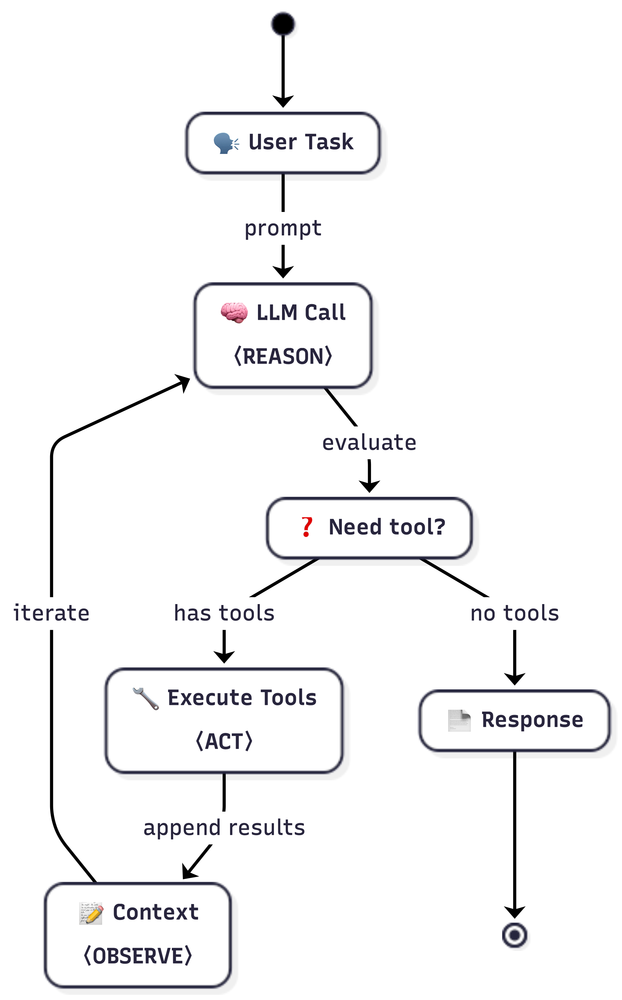

<div align="center">

# 🔬 Agentic Apps Internals

**How AI coding agents actually work under the hood**\
System prompts, tool architectures, session traces, and implementation patterns — captured from real agent sessions.

*by [AgenticLoops.ai](https://agenticloops.ai) - for Engineers, from Engineers*

[](https://agenticloops.ai)
[](https://agenticloopsai.substack.com)
[](https://www.linkedin.com/company/agenticloops-ai)
[](https://x.com/agenticloops_ai)
<!-- [](https://github.com/agenticloops-ai/agentic-apps-internals/stargazers)
[](https://github.com/agenticloops-ai/agentic-apps-internals/commits/main) -->

</div>

## 🔍 What's Inside

This repository contains captured API traffic, decoded system prompts, complete tool schemas, and turn-by-turn session traces from real AI coding agent sessions. Everything here comes from actual intercepted data — no guesswork, no assumptions.

**For each agent you'll find:**

- **System Prompts** — the exact instructions that shape agent behavior, extracted from live API traffic
- **Tool Catalogs** — complete tool definitions with full JSON schemas, descriptions, and categories
- **Session Traces** — turn-by-turn breakdowns showing every LLM call, tool use, and token count
- **Prompt Engineering Analysis** — how each agent structures its prompts, what sections they include, and how prompts change between modes

> **Interesting things you'll discover:**
>
> 📖 [The exact system prompt that tells Claude Code to "avoid over-engineering"](claude-code-cli/agent-mode/system-prompt.md) — and the detailed rules that follow it\
> 🔄 [Why Copilot sends 8 overhead requests before your task even starts](github-copilot/PROMPT-ENGINEERING.md) — the multi-model routing pipeline\
> ⚖️ [5 tools vs 65 tools — same task, radically different approaches](codex-cli/TOOL-USE.md) — Codex CLI's minimalism vs Copilot's comprehensive toolset\
> 🧠 [Codex CLI's explicit engineering values: "Clarity, Pragmatism, Rigor"](codex-cli/agent-mode/system-prompt.md) — personality encoded directly in the system prompt

**Useful for:**

- **AI Engineers** building coding assistants or agent systems
- **Researchers** studying LLM agent architectures and prompt design
- **Developers** learning advanced prompt engineering from production systems
- **Anyone** curious about what happens behind `/ask`, `/agent`, or `/plan`

---

## 🗺️ Start Here

New to the repo? Follow this reading path:

1. **Pick an agent** — Choose [Claude Code](claude-code-cli/), [Codex CLI](codex-cli/), or [Copilot](github-copilot/) and read its README
2. **System Prompt** — Read the agent's `system-prompt.md` to see the exact instructions it receives
3. **Prompt Engineering** — Read `PROMPT-ENGINEERING.md` for how the prompt is structured and how it changes between modes
4. **Tool Catalog** — Browse `TOOL-USE.md` for the full tool definitions with JSON schemas
5. **Session Traces** — Check `session.md` for turn-by-turn breakdowns of real agent sessions

---

## 🤖 Agents Analyzed

| Agent | Type | Main Model | Overhead Model | Agent Tools | Status |
|-------|------|-----------|----------------|-------------|--------|
| [**Claude Code**](claude-code-cli/) | CLI | claude-opus-4-6 | claude-haiku-4-5 | 24 |  |
| [**Codex CLI**](codex-cli/) | CLI | gpt-5.3-codex | — | 5 |  |
| [**GitHub Copilot**](github-copilot/) | VS Code | user-selected ¹ | gpt-4o-mini | 65 |  |
| **Cursor** | IDE | — | — | — |  |
| **Windsurf** | IDE | — | — | — |  |
| **Cline** | VS Code | — | — | — |  |
| **Aider** | CLI | — | — | — |  |

> ¹ GitHub Copilot lets users select their main model. This analysis uses gpt-5.3-codex, which was selected during our capture session. The overhead model (gpt-4o-mini) is not user-selectable. Other model choices may produce different behavior.

---

## 🔬 Research Approach

All data in this repository was captured using [**AgentLens**](https://github.com/agenticloops-ai/agentlens), an open-source MITM proxy that intercepts LLM API traffic during normal agent use.

**How it works:**

1. **Capture** — AgentLens sits between the agent and the LLM API, recording every request and response (system prompts, tool definitions, messages, token usage, timing)
2. **Export** — Raw session data is exported as structured JSON with per-request breakdowns
3. **Analyze** — AgentLens exports are manually analyzed and processed into structured markdown: per-agent READMEs, prompt engineering analysis, tool catalogs, and session traces
4. **Verify** — Tool counts, prompt completeness, and schema validity are spot-checked against the raw data

> See [RESEARCH.md](RESEARCH.md) for the full methodology, deliverable structure, and analysis pipeline details.

---

## ⚙️ How Agents Work

Every AI coding agent in this repository follows the same fundamental loop — **Reason → Act → Observe**:

<p align="center">
  
</p>

1. **Reason** — The LLM receives the user's task plus conversation context. It decides what to do next and whether it needs to use a tool.
2. **Act** — If a tool is needed, the agent executes it (read a file, run a command, search code). The tool result is appended to the context.
3. **Observe** — The updated context (with tool results) is sent back to the LLM for the next reasoning step. The loop repeats until the task is complete.

All three agents analyzed here implement this exact pattern — but the *details* differ dramatically: how many tools they expose (5 vs 65), how they restrict capabilities between modes, whether they cache prompts, and how they route requests through multiple models.

> 📚 **Deep dive:** [How Agents Work: The Patterns Behind the Magic](https://agenticloopsai.substack.com/p/how-agents-work-the-patterns-behind)\
> 🛠️ **Build your own:** [Agentic AI Engineering Tutorials](https://github.com/agenticloops-ai/agentic-ai-engineering)

---

## 💡 Key Insights

These are patterns we found interesting while analyzing the captured sessions — the kind of implementation details you won't find in product docs:

1. **Same loop, different philosophies** — All three agents implement Reason-Act-Observe, but Codex CLI does it with 5 tools and a "just use the shell" philosophy, while Copilot provides 65 specialized tools for granular control. Claude sits in the middle with 24.

2. **Mode restrictions reveal design thinking** — Claude Code keeps the same 24 tools in both Agent and Plan mode, controlling behavior through runtime-injected `<system-reminder>` tags in conversation turns ("Plan mode is active... you MUST NOT make any edits") rather than the system prompt itself (which is identical across modes). Copilot takes the opposite approach: it physically removes write/execute tools in Plan mode (65 → 22), making unsafe actions structurally impossible.

3. **Prompt caching is a major differentiator** — Claude Code reads ~595K cached tokens and creates ~77K cache tokens per session. This means the large system prompt and tool definitions are sent once and reused across turns. Neither Codex CLI nor Copilot show prompt caching in their captured sessions.

4. **Multi-model pipelines hide overhead** — Claude Code uses claude-haiku for warmup/quota checks and extracting file paths from command outputs (not titling or categorization). Copilot uses gpt-4o-mini for titling and activity summarization in agent mode, with request categorization only in ask mode. Codex CLI skips this entirely — zero overhead requests.

5. **System prompts encode engineering culture** — Codex CLI's prompt opens with explicit values ("Clarity, Pragmatism, Rigor"). Claude Code's prompt includes detailed anti-over-engineering rules ("Don't add features beyond what was asked. Three similar lines of code is better than a premature abstraction"). These aren't just instructions — they shape the agent's personality.

6. **Tool design reflects trust boundaries** — Codex CLI trusts a single `exec_command` tool for nearly everything (file ops, git, testing). Copilot separates concerns across 65 tools with distinct schemas and permissions. Claude provides dedicated tools (Glob, Grep, Read, Edit) but warns against falling back to shell equivalents.

---

## 📂 Repository Structure

Each agent follows the same directory pattern:

```
<agent-name>/
├── README.md                # Agent summary + session metrics
├── PROMPT-ENGINEERING.md    # System prompt analysis (structure, sections, mode differences)
├── TOOL-USE.md              # Complete tool catalog with full JSON schemas
├── agent-mode/
│   ├── system-prompt.md     # Exact system prompt text
│   ├── user-prompt.md       # User message with injected context (skills, project, task)
│   ├── session.md           # Session summary
│   ├── transcript.md        # Full session transcript
│   └── log/
│       ├── session.json     # Raw captured API traffic
│       └── session.csv      # Per-request metrics (tokens, cost, timing)
└── plan-mode/               # Same structure, repeated per mode
    └── ...
```

**Agents:** [`claude-code-cli/`](claude-code-cli/) · [`codex-cli/`](codex-cli/) · [`github-copilot/`](github-copilot/)

**Other files:** [`tools/lens-run.sh`](tools/lens-run.sh) (capture launcher) · [`RESEARCH.md`](RESEARCH.md) (methodology) · [`CONTRIBUTING.md`](CONTRIBUTING.md)

---

## ⚠️ Disclaimer

This repository is for **educational and research purposes only**. All trademarks belong to their respective owners. The goal is to understand and learn from these systems, not to replicate proprietary services.

## 📜 Legal Notice

This analysis was conducted through observation of network traffic during normal use of publicly available software. No security measures were bypassed, no proprietary source code was accessed, and no terms of service were violated beyond what is necessary for standard interoperability research.

This is independent research and is not affiliated with, endorsed by, or connected to GitHub, Microsoft, Anthropic, OpenAI, or any other company analyzed.

## ⚖️ License

MIT — See individual agent analyses for their respective product licenses.
