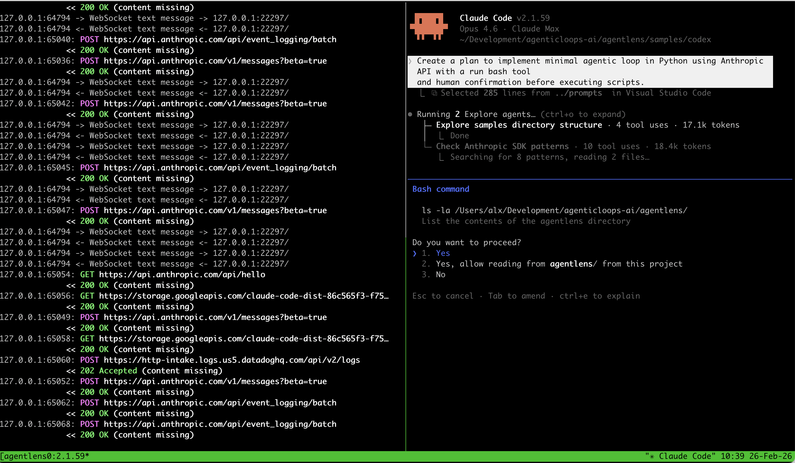
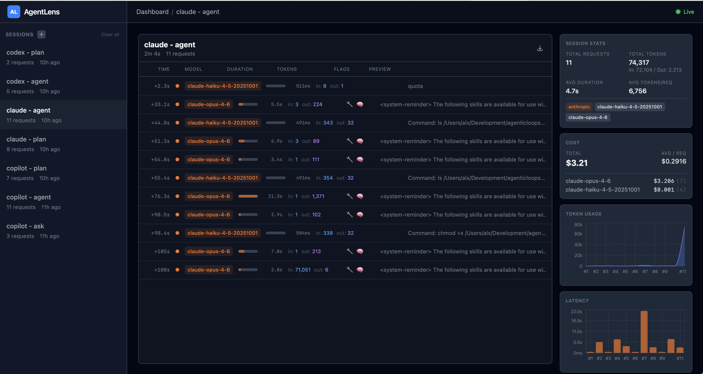

# Research Approach

How we capture and analyze AI coding agent internals.

## Overview

We use [AgentLens](https://github.com/agenticloops-ai/agentlens) — an open-source MITM proxy — to intercept all LLM API traffic between an AI coding agent and its provider. This captures the complete picture: system prompts, tool definitions, messages, token usage, timing, and costs — without modifying the agent itself.

The approach is agent-agnostic. Any tool that makes LLM API calls through standard HTTP(S) can be profiled this way.

## How to Run a Capture Session

### Prerequisites

- [AgentLens](https://github.com/agenticloops-ai/agentlens) installed (`pip install agentlens-proxy`)
- [mitmproxy](https://mitmproxy.org/) CA certificate installed (`~/.mitmproxy/mitmproxy-ca-cert.pem`)
- `tmux` installed

### Using the Capture Script

The [`tools/lens-run.sh`](tools/lens-run.sh) script automates the full capture workflow. It launches a tmux session with two panes: one running AgentLens in wait mode, the other running your agent command with proxy environment variables pre-configured.

```bash
# Basic usage
./tools/lens-run.sh -- <agent-command>

# Examples
./tools/lens-run.sh -- claude -p "your prompt here"
./tools/lens-run.sh -- codex --model gpt-5.3-codex "your prompt here"

# Custom output directory and session name
./tools/lens-run.sh -o results/my-capture -s my-session -- <agent-command>
```

**What the script does:**



1. Starts AgentLens in wait mode (`agentlens wait`), listening on `localhost:8080`
2. Opens a second tmux pane with proxy environment variables set:
   - `HTTP_PROXY` / `HTTPS_PROXY` → `http://127.0.0.1:8080`
   - `NODE_EXTRA_CA_CERTS` / `SSL_CERT_FILE` / `REQUESTS_CA_BUNDLE` / `CURL_CA_BUNDLE` → mitmproxy CA cert
3. Runs the agent command in the proxied pane
4. AgentLens captures all LLM API traffic passing through the proxy
5. On completion, exports the session data to the output directory

You can then explore the captured results in the AgentLens web UI — per-request breakdown with model, tokens, duration, cost, and latency charts:



### Capture Per Mode

To analyze how an agent behaves in different modes, run a separate capture session for each mode:

```bash
# Agent mode
./tools/lens-run.sh -o results/agent -s agent -- <agent-command> --mode agent "your prompt"

# Plan mode
./tools/lens-run.sh -o results/plan -s plan -- <agent-command> --mode plan "your prompt"
```

The exact flags depend on the agent. The key is to use a prompt appropriate for the mode so you can observe how the agent handles that type of task.

## Prompts Used

Each mode was tested with a prompt designed to exercise that mode's specific capabilities:

### Agent Mode (implementation)

```
Implement minimal agentic loop in Python using Anthropic API with a run bash tool
and human confirmation before executing scripts. Implement as a standalone script `agent-loop.py`
```

This prompt exercises the full agent loop: reasoning about architecture, creating files, writing code, and running validation commands.

### Plan Mode (planning)

```
Create a plan to implement minimal agentic loop in Python using Anthropic API with a run bash tool
and human confirmation before executing scripts.
```

Same core task, but asks for a plan rather than implementation. This reveals how agents restrict themselves in plan mode — do they read files but refuse to write? Do they lose access to tools entirely?

### Ask Mode (Q&A)

```
What is the difference between ReAct and plan-and-execute as agentic design patterns?
When would you choose one over the other?
```

A knowledge question with no file or tool requirements. Tests the agent's behavior when no tools are needed — does it still have tools available? Does the routing pipeline differ?

### Why these prompts

- **Agent mode** requires file creation, code generation, and multiple tool calls — exercises the full Reason-Act-Observe loop
- **Plan mode** uses the same task to isolate how mode restrictions change behavior
- **Ask mode** uses a conceptual question to observe the minimal agent pipeline
- All produce **clear, verifiable results** that can be compared across agents

## Result Structure

Each captured agent produces the following output:

```
<agent-name>/
│
├── README.md                     # Agent summary
│   ├── Provider and model(s) used
│   ├── Modes captured
│   ├── Session metrics table (mode | requests | tokens | wall time)
│   ├── Architecture notes (multi-model pipeline, overhead, caching)
│   └── Key observations
│
├── PROMPT-ENGINEERING.md         # System prompt deep dive
│   ├── Prompt structure overview (format, length, sections per mode)
│   ├── Per-mode breakdown with annotated excerpts
│   ├── Key sections: persona, safety, tool instructions, formatting, constraints
│   ├── Mode delta: what changes between modes
│   └── Structure analysis: XML tags, markdown headers, bullet lists
│
├── TOOL-USE.md                   # Full tool catalog
│   ├── Tool count summary per mode
│   ├── Per-tool entry: name, full description, complete JSON schema, category
│   ├── Mode delta: tools added/removed between modes
│   └── Tool invocation patterns observed in sessions
│
└── <mode-name>/                  # One directory per captured mode
    │                             #   (e.g. agent-mode/, plan-mode/, ask-mode/)
    │
    ├── system-prompt.md          # Raw extracted system prompt(s)
    │   ├── Each model's prompt, clearly labeled
    │   ├── Overhead prompts separated from main prompts
    │   └── Unedited full text — the reference copy
    │
    ├── session.md                # Session summary
    │   ├── Session metadata (start, end, request count, tokens)
    │   ├── Per-request summary table (model, duration, tokens, action)
    │   └── Turn-by-turn trace (model → tool calls → stop reason)
    │
    ├── transcript.md             # Full session transcript
    │
    ├── result/                   # Agent output artifacts (if any)
    │
    └── log/                      # Raw session data
        ├── session.json          # Complete captured API traffic
        └── session.csv           # Flattened request summary (tabular)
```

### What's in session.json

The JSON export contains the complete API traffic for the session:

- **Session metadata** — ID, name, timestamps, total token counts
- **Per-request data:**
  - Model and provider
  - Timing (duration, time-to-first-token)
  - Parameters (temperature, max_tokens, top_p)
  - Full system prompt text
  - User messages with content blocks
  - Tool definitions (complete JSON schemas)
  - Response messages (text, tool calls, thinking blocks)
  - Token usage breakdown (input, output, cache read, cache creation)
  - Stop reason (end_turn, tool_use, max_tokens)

## Verification

After generating analysis documents from session data, verify:

- [ ] Each agent directory has `README.md`, `PROMPT-ENGINEERING.md`, `TOOL-USE.md`
- [ ] Each mode subdirectory has `system-prompt.md` and `session.md`
- [ ] System prompts are complete and untruncated
- [ ] Tool catalogs include full JSON schemas, not just tool names
- [ ] Token counts and request counts match the raw session data
